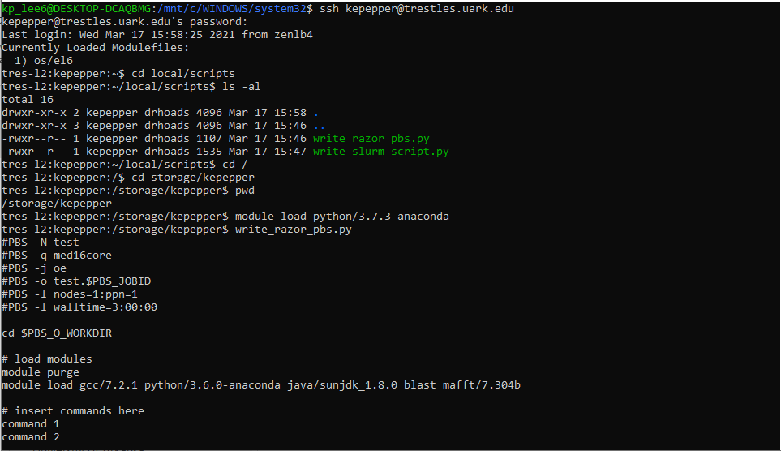

## BIOL5153

#### Files

* assn03.tgz

	This is a zipped file containing the required submissions for BIOL5153 assignment 3. 

* write_razor_pbs.py

	This is a Python PBS script to streamline executing jobs on the cluster.

* write_slurm_script.py

	This is a Python SLURM script to streamline executing jobs on the cluster. 

	This screenshot shows my scripts being executable from storage/kepepper.

* nucleotide_composition.py

	This is Python script meant to be used to calculate general nucleotide composition statistics for a given FASTA file.

* parse_GFF.py

	This is a Python script meant to read a GFF and FASTA file and return important details and the nucleotide sequence for each gene provided; submitted for assignment 6.
